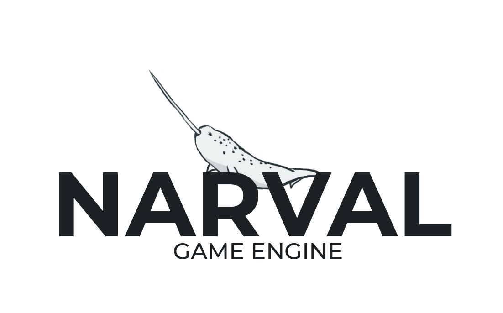

<h1>Narval Engine 2D</h1>

Game engine made in java using OpenGL and GLFW. Done as a prototype and proper introduction into the game development world. Delivered as a partial requirement in order to obtain my Bachelor's Degree at UFU.
The written project explaining details and the whole throught process can be found <a href="https://github.com/ibfernandes/tcc">here</a> in portuguese.

<h2>Installation</h2>

Tested on windows 7 and 10 on Eclipse.

<h2>License</h2>
MIT